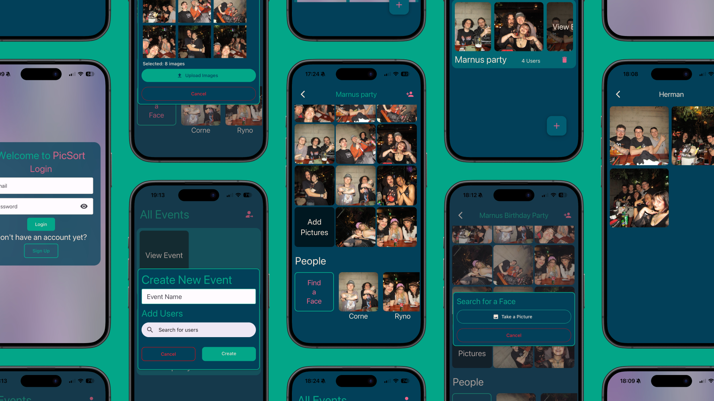
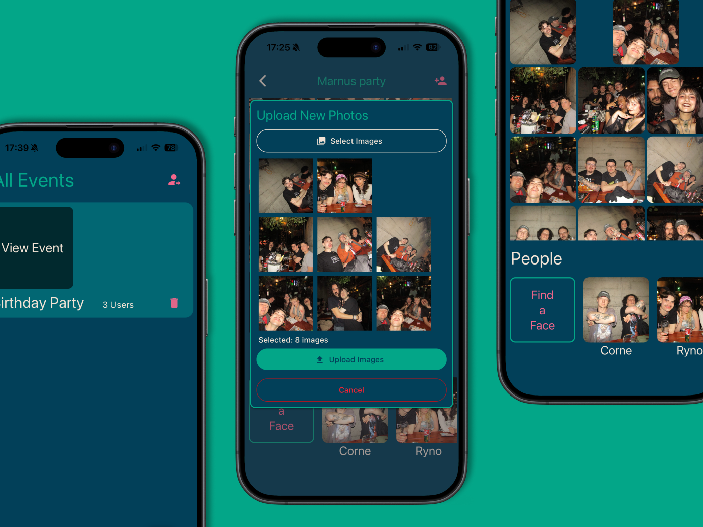
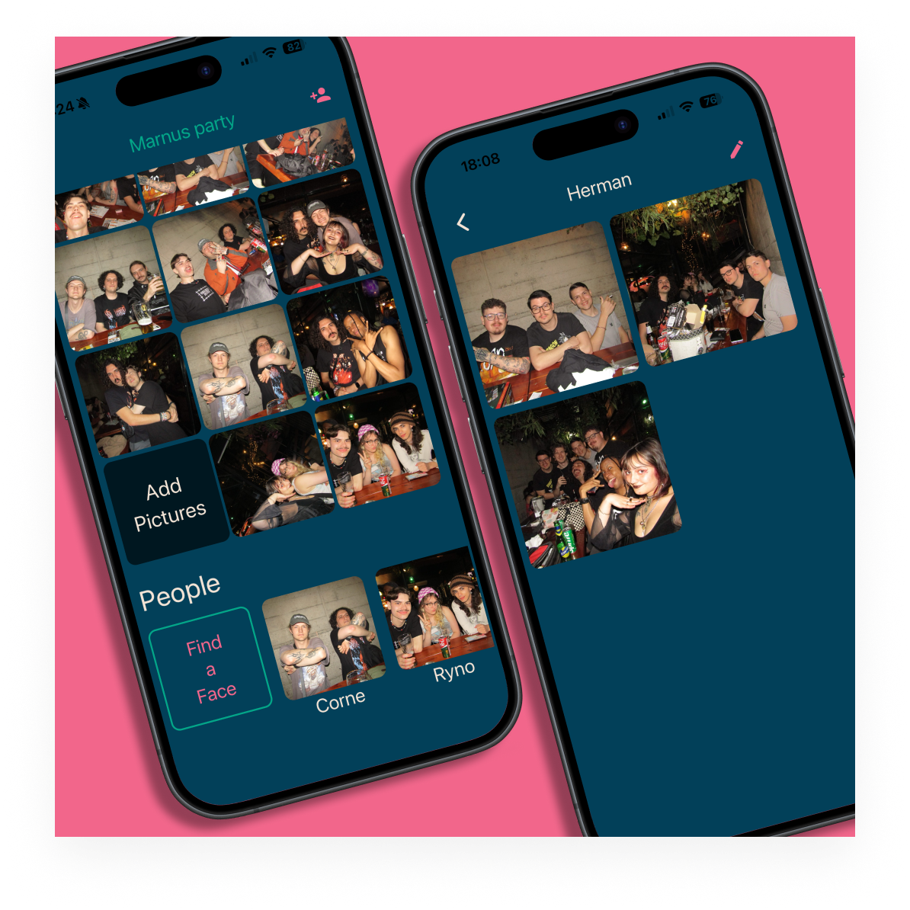
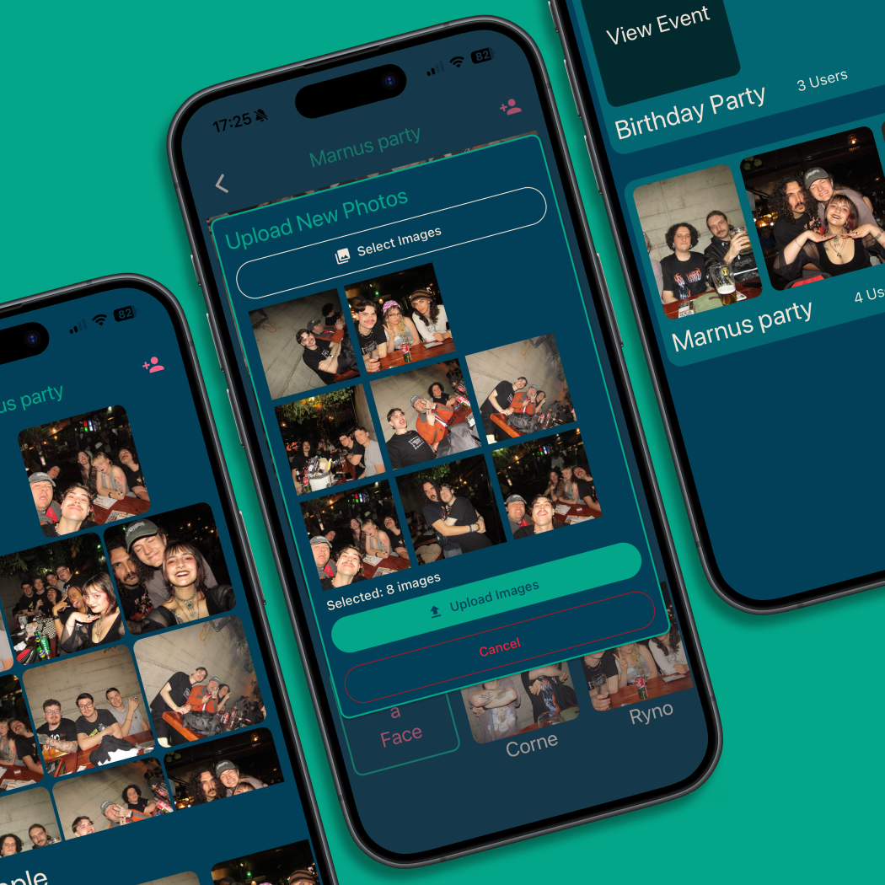
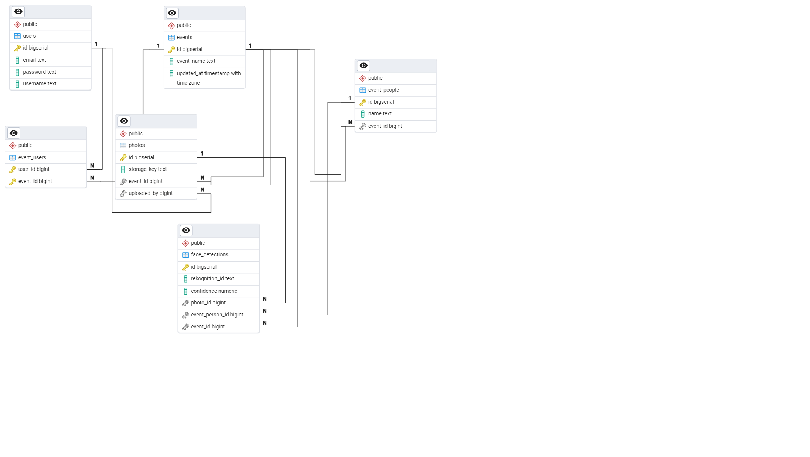

# 📸 PicSort

**Smart Image Sorting and Management Tool**

<!-- TABLE OF CONTENTS --> 
 
Table of Contents
 <ol> <li><a href="#-about">🧠 About</a></li> <li><a href="#-built-with">🛠️ Built With</a></li> <li><a href="#-getting-started">🚀 Getting Started</a></li> <li><a href="#-project-features">✨ Project Features</a></li> <li><a href="#-development-process">🧩 Development Process</a></li> <li><a href="#-final-outcome">🏁 Final Outcome</a></li> </ol> 

----------

## 🧠 About

PicSort is a tool designed to help users efficiently organise, sort, and manage images based on facial recognition data.

PicSort looks to address the messy way in which photos get shared after an event, often wasting storage space and mobile data on image downloads, and users' time swiping through countless photos.

This project provides one location where all images can get uploaded to, stored in cloud bucket storage and sorted into specific collections based on the faces in the photos.

----------

## 🛠️ Built With

- **Backend: ** Go, GORM, Fiber 
- **Database:** PostgreSQL
- **Containerization:** Docker
- **Hosting:** AWS
	- S3 Storage
	- Aurora DB
	- ECS Fargate container instance
- **AI:** AWS Rekognition
- **Frontend:** React Native, Expo

----------

## 🚀 Getting Started

### Prerequisites

Make sure the following are installed and configured:

#### Backend

-   **Go** (v1.22 or higher)
    
-   **Git**
    

#### Frontend

-   **Node.js** (v18+ recommended)
    
-   **npm** or **yarn**
    
-   **Expo CLI** (`npm install -g expo-cli`)
    
-   **Expo Go** app installed on your mobile device (for live testing)
    

----------

### Installation

#### 1. **Clone the Repository**

	`git clone https://github.com/Rynoo1/PicSort.git
	cd PicSort`

#### 2. **Backend Setup (Go + Fiber)**

1.  Navigate to the backend folder:

	`cd backend`

2. Install Go dependencies:

	`go mod tidy`

3. Create a `.env` file in the backend directory (if not already present):

	`touch .env`

4. Run the development server:

	`go run main.go`

The backend API will now be available at:

	`http://localhost:8080`

#### 3. **Frontend Setup (React Native + Expo)**

1.  Open a new terminal window (keep the backend running), then navigate to the frontend directory:

	`cd ../frontend`

2. Install dependencies:

	`npm install`
	or
	`yarn install`

3. Configure your backend API URL:  
Inside your React Native frontend, create a file called `.env` or use a configuration constant:

	`API_URL=http://localhost:8080`

4. Start the Expo development server:

	`npx expo start`

This will open a local server dashboard in your browser.
    
5. Run the app:
    
    -   **On mobile:** Scan the QR code with the **Expo Go** app.
        
    -   **On emulator:** Press `i` for iOS or `a` for Android in the Expo CLI.

#### 4. **Verify the Connection**

Once both servers are running:

-   Backend: `http://localhost:8080`
    
-   Frontend: Expo app showing the UI
    

You should be able to perform actions such as:

-   Uploading or scanning images
    
-   Viewing sorted folders
    
-   Testing API endpoints via the frontend interface

## ✨ Project Features

### **Automatic Sorting**

Organises images into collections based on facial recognition data

### **Batch Processing**

Handles multiple image uploads at once

## 🧩 Development Process

During the development, some of the problems faced included:

1. Concurrency:
Since PicSort handles large batches of media, concurrency was an important aspect to this project. Learning Go allowed me to take advantage of concurrency and run image uploads and certain processing concurrently. However, this did also lead to problems and needing to refactor certain sections to run sequentially after others ran concurrently.

2. Image Conversion:
Since Rekognition does not support formats such as HEIC (used by Apple), the images needed to first be converted to a compatible format, such as jpeg, before being uploaded to the storage bucket and passed to the AI for processing.

3. Caching:
To optimise performance, the presigned URLs are cached on the front end for faster loading, after the initial load. For this to work correctly, I needed to make changes to the backend and database, so that an updated at timestamp would also be stored in the Events table - so that this can be used to determine when to refresh the cached event data, if changes, such as uploads or deletes, have been made to the event DB record.

### ERD:

## 🏁 Final Outcome

### [Demo Video](https://drive.google.com/file/d/1p0i5AE8h_-4gTVei5OS4qOBUYTy8TQWY/view?usp=sharing)
